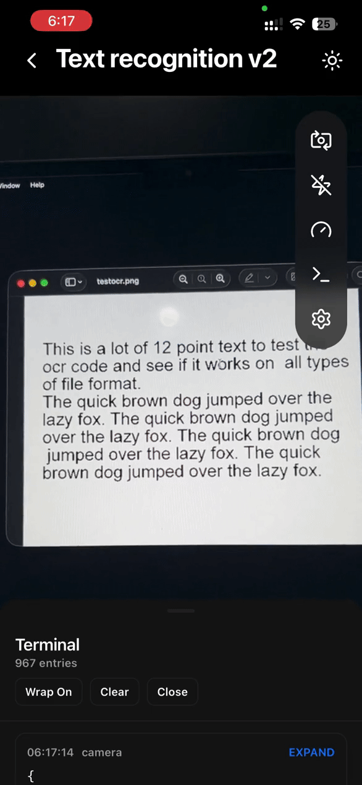

# react-native-vision-camera-mlkit

<a href="https://youtube.com/shorts/Wtp-Ji18bWE?feature=share">
  
</a>

[![Contributors][contributors-shield]][contributors-url]
[![Forks][forks-shield]][forks-url]
[![Stargazers][stars-shield]][stars-url]
[![Issues][issues-shield]][issues-url]
[![MIT License][license-shield]][license-url]
[![NPM Version][npm-version-shield]][npm-version-url]

A [React Native Vision Camera](https://github.com/mrousavy/react-native-vision-camera) plugin that exposes high-performance [Google ML Kit](https://developers.google.com/ml-kit) [frame processor](https://react-native-vision-camera.com/docs/guides/frame-processors) features such as text recognition (OCR), face detection, barcode scanning, pose detection, and more.

> The example app is intentionally heavy and demo-focused. For integration details, follow the documentation below.

## Requirements

- iOS 12+ and Android SDK 21+
- [react-native-vision-camera](https://www.npmjs.com/package/react-native-vision-camera)
- [react-native-worklets-core](https://www.npmjs.com/package/react-native-worklets-core)

Install Vision Camera (React Native):

```sh
npm i react-native-vision-camera
cd ios && pod install
```

Install Worklets Core:

```sh
npm i react-native-worklets-core
# or
yarn add react-native-worklets-core
```

Add the Babel plugin in `babel.config.js`:

```js
module.exports = {
  plugins: [['react-native-worklets-core/plugin']],
};
```

> For Expo, follow the Vision Camera guide: [react-native-vision-camera.com/docs/guides](https://react-native-vision-camera.com/docs/guides)

## Installation

```sh
npm install react-native-vision-camera-mlkit
# or
yarn add react-native-vision-camera-mlkit

cd ios && pod install
```

## ML Kit Models Installation (Selective)

By default, all ML Kit features are enabled. You can selectively include only the models you need to reduce binary size.

### Android (Gradle)

In your app's `android/build.gradle` (root project), add:

```gradle
ext["react-native-vision-camera-mlkit"] = [
  mlkit: [
    textRecognition: true,
    textRecognitionChinese: false,
    textRecognitionDevanagari: false,
    textRecognitionJapanese: false,
    textRecognitionKorean: false,
    faceDetection: false,
    faceMeshDetection: false,
    poseDetection: false,
    poseDetectionAccurate: false,
    selfieSegmentation: false,
    subjectSegmentation: false,
    documentScanner: false,
    barcodeScanning: true,
    imageLabeling: false,
    objectDetection: false,
    digitalInkRecognition: false,
  ]
]
```

### iOS (Podfile)

In your `ios/Podfile`, add a configuration hash before `target`:

```ruby
$VisionCameraMLKit = {
  'textRecognition' => true,
  'textRecognitionChinese' => false,
  'textRecognitionDevanagari' => false,
  'textRecognitionJapanese' => false,
  'textRecognitionKorean' => false,
  'faceDetection' => false,
  'poseDetection' => false,
  'poseDetectionAccurate' => false,
  'selfieSegmentation' => false,
  'barcodeScanning' => true,
  'imageLabeling' => false,
  'objectDetection' => false,
  'digitalInkRecognition' => false,
}
```

Android-only keys: `faceMeshDetection`, `subjectSegmentation`, `documentScanner`.

Note: If you enable any non-Latin text recognition model, keep the base `textRecognition` enabled as well. Some shared code paths are still guarded by `#if MLKIT_TEXT_RECOGNITION`, so disabling it will break the extra language models. This will be fixed in a future version.

Example configuration:

```ruby
$VisionCameraMLKit = {
  'textRecognition' => true,
  'textRecognitionChinese' => false,
  'textRecognitionDevanagari' => false,
  'textRecognitionJapanese' => false,
  'textRecognitionKorean' => true,
}
```

## Usage

### Text Recognition (Frame Processor)

```ts
import {
  useFrameProcessor,
  runAsync,
  runAtTargetFps,
} from 'react-native-vision-camera';
import { useTextRecognition } from 'react-native-vision-camera-mlkit';

const { textRecognition } = useTextRecognition({
  language: 'LATIN',
  scaleFactor: 1,
  invertColors: false,
});

const frameProcessor = useFrameProcessor(
  (frame) => {
    'worklet';

    runAtTargetFps(10, () => {
      'worklet';
      runAsync(frame, () => {
        'worklet';
        const result = textRecognition(frame, {
          outputOrientation: 'portrait',
        });
        console.log(result.text);
      });
    });
  },
  [textRecognition]
);
```

`TextRecognitionOptions`:

- `language?: 'LATIN' | 'CHINESE' | 'DEVANAGARI' | 'JAPANESE' | 'KOREAN'`
- `scaleFactor?: number` (0.9-1.0)
- `invertColors?: boolean`
- `frameProcessInterval?: number` (deprecated, use `runAtTargetFps`)

`TextRecognitionArguments`:

- `outputOrientation?: 'portrait' | 'portrait-upside-down' | 'landscape-left' | 'landscape-right'` (iOS only)

### Image Processing (Static Images)

Use `processImageTextRecognition` to analyze a file path or URI without the camera (for example, images picked from the gallery).

```ts
import { processImageTextRecognition } from 'react-native-vision-camera-mlkit';

const result = await processImageTextRecognition(imageUri, {
  language: 'LATIN',
  orientation: 'portrait',
  invertColors: false,
});

console.log(result.blocks);
```

`TextRecognitionImageOptions`:

- `language?: 'LATIN' | 'CHINESE' | 'DEVANAGARI' | 'JAPANESE' | 'KOREAN'`
- `orientation?: 'portrait' | 'portrait-upside-down' | 'landscape-left' | 'landscape-right'`
- `invertColors?: boolean`

The native bridge normalizes URIs (`file://` is removed on iOS and added on Android if missing). Supported formats: JPEG, PNG, WebP.

### Feature Utilities

The package also exposes helpers from the plugin factory:

```ts
import {
  getFeatureErrorMessage,
  isFeatureAvailable,
  assertFeatureAvailable,
  getAvailableFeatures,
} from 'react-native-vision-camera-mlkit';
```

- `getAvailableFeatures(): MLKitFeature[]`
- `isFeatureAvailable(feature: MLKitFeature): boolean`
- `assertFeatureAvailable(feature: MLKitFeature): void`
- `getFeatureErrorMessage(feature: MLKitFeature): string`

### Error Handling

Frame processors throw a setup error when the feature is not enabled in Gradle/Podfile. For static image processing, the following error strings are exported:

- `IMAGE_NOT_FOUND_ERROR`
- `INVALID_URI_ERROR`
- `IMAGE_PROCESSING_FAILED_ERROR`
- `UNSUPPORTED_IMAGE_FORMAT_ERROR`

Use the feature helpers to provide user-friendly configuration hints:

```ts
import {
  assertFeatureAvailable,
  MLKIT_FEATURE_KEYS,
} from 'react-native-vision-camera-mlkit';

assertFeatureAvailable(MLKIT_FEATURE_KEYS.TEXT_RECOGNITION);
```

## Performance

- Follow the Vision Camera [performance guide](https://react-native-vision-camera.com/docs/guides/performance)
- Prefer `runAsync(...)` for heavy ML work to keep the frame processor responsive.
- Use `runAtTargetFps(...)` to throttle processing instead of `frameProcessInterval`.

## iOS Orientation Notes (Text Recognition)

iOS camera sensors are fixed in landscape orientation. The frame buffer stays landscape-shaped even when the UI rotates, so ML Kit needs an explicit orientation hint to rotate text correctly. On iOS, pass `outputOrientation` to `textRecognition(frame, { outputOrientation })` so ML Kit can map the buffer to upright text. Android handles rotation automatically.

### ⚠️ iOS Simulator (Apple Silicon) – Heads-up

On Apple Silicon Macs, building for the **iOS Simulator (arm64)** may fail after installing this package.

This is a **known limitation of Google ML Kit**, which does not currently ship an `arm64-simulator` slice for some iOS frameworks.
The library works correctly on **physical iOS devices** and on the **iOS Simulator when running under Rosetta**.

## Google ML Kit Vision Features Roadmap

| #   | Feature                           | Status                                     | Platform                                          |
| --- | --------------------------------- | ------------------------------------------ | ------------------------------------------------- |
| 0   | **Text recognition v2**           | [![complete][complete]][complete]          | [![android][android]][android] [![ios][ios]][ios] |
| 1   | **Barcode scanning**              | [![complete][complete]][complete]          | [![android][android]][android] [![ios][ios]][ios] |
| 2   | **Face detection**                | [![in-progress][in-progress]][in-progress] | [![android][android]][android] [![ios][ios]][ios] |
| 3   | **Face mesh detection**           | [![in-progress][in-progress]][in-progress] | [![android][android]][android]                    |
| 4   | **Pose detection**                | [![in-progress][in-progress]][in-progress] | [![android][android]][android] [![ios][ios]][ios] |
| 5   | **Selfie segmentation**           | [![in-progress][in-progress]][in-progress] | [![android][android]][android] [![ios][ios]][ios] |
| 6   | **Subject segmentation**          | [![in-progress][in-progress]][in-progress] | [![android][android]][android]                    |
| 7   | **Document scanner**              | [![in-progress][in-progress]][in-progress] | [![android][android]][android]                    |
| 8   | **Image labeling**                | [![in-progress][in-progress]][in-progress] | [![android][android]][android] [![ios][ios]][ios] |
| 9   | **Object detection and tracking** | [![in-progress][in-progress]][in-progress] | [![android][android]][android] [![ios][ios]][ios] |
| 10  | **Digital ink recognition**       | [![in-progress][in-progress]][in-progress] | [![android][android]][android] [![ios][ios]][ios] |

## Sponsor on GitHub

If this project helps you, please consider [sponsoring its development](https://github.com/sponsors/pedrol2b)

react-native-vision-camera-mlkit is provided as is and maintained in my free time.

If you’re integrating this library into a production app, consider funding the project.

[complete]: https://img.shields.io/badge/COMPLETE-5E5CE6
[in-progress]: https://img.shields.io/badge/IN%20PROGRESS-FFD60A
[android]: https://img.shields.io/badge/ANDROID-3DDC84
[ios]: https://img.shields.io/badge/IOS-0A84FF
[contributors-shield]: https://img.shields.io/github/contributors/pedrol2b/react-native-vision-camera-mlkit.svg?style=for-the-badge
[contributors-url]: https://github.com/pedrol2b/react-native-vision-camera-mlkit/graphs/contributors
[forks-shield]: https://img.shields.io/github/forks/pedrol2b/react-native-vision-camera-mlkit.svg?style=for-the-badge
[forks-url]: https://github.com/pedrol2b/react-native-vision-camera-mlkit/network/members
[stars-shield]: https://img.shields.io/github/stars/pedrol2b/react-native-vision-camera-mlkit.svg?style=for-the-badge
[stars-url]: https://github.com/pedrol2b/react-native-vision-camera-mlkit/stargazers
[issues-shield]: https://img.shields.io/github/issues/pedrol2b/react-native-vision-camera-mlkit.svg?style=for-the-badge
[issues-url]: https://github.com/pedrol2b/react-native-vision-camera-mlkit/issues
[license-shield]: https://img.shields.io/github/license/pedrol2b/react-native-vision-camera-mlkit.svg?style=for-the-badge
[license-url]: https://github.com/pedrol2b/react-native-vision-camera-mlkit/blob/main/LICENSE
[npm-version-shield]: https://img.shields.io/npm/v/react-native-vision-camera-mlkit.svg?style=for-the-badge
[npm-version-url]: https://www.npmjs.com/package/react-native-vision-camera-mlkit
