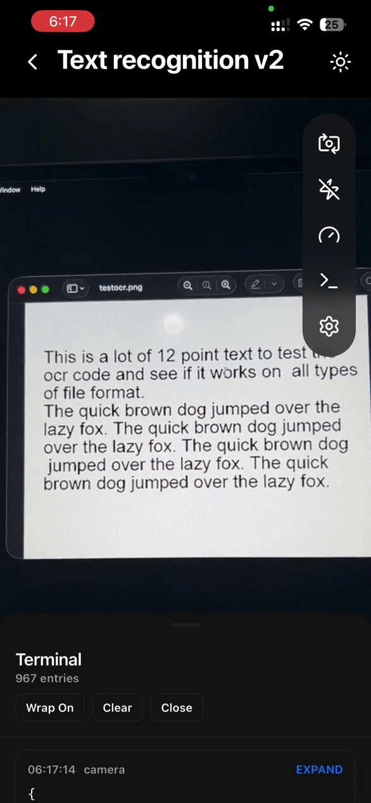

# react-native-vision-camera-mlkit

<a href="https://youtube.com/shorts/Wtp-Ji18bWE?feature=share">
  
</a>

[![Contributors][contributors-shield]][contributors-url]
[![Forks][forks-shield]][forks-url]
[![Stargazers][stars-shield]][stars-url]
[![Issues][issues-shield]][issues-url]
[![MIT License][license-shield]][license-url]
[![NPM Version][npm-version-shield]][npm-version-url]

A Nitro-based [React Native Vision Camera](https://github.com/mrousavy/react-native-vision-camera) v5 plugin that exposes high-performance [Google ML Kit](https://developers.google.com/ml-kit) [frame output](https://visioncamera.margelo.com/docs/frame-output) features. v2 implements text recognition (OCR) and barcode scanning for live frames and static images. Other ML Kit vision features are post-v2 roadmap items.

> The example app is intentionally heavy and demo-focused. For integration details, follow the documentation below.

## Requirements

- React Native 0.86+
- iOS 15.1+ and Android SDK 24+
- [react-native-vision-camera](https://www.npmjs.com/package/react-native-vision-camera) `>=5` (Nitro-based v5, not v4)
- [react-native-nitro-modules](https://www.npmjs.com/package/react-native-nitro-modules)

Install Vision Camera and its Nitro dependency:

```sh
npm i react-native-vision-camera react-native-nitro-modules
cd ios && pod install
```

> `react-native-vision-camera` has its own peer dependencies (currently
> `react-native-nitro-image`); follow the prompts from your package manager
> or the [Vision Camera docs](https://visioncamera.margelo.com/docs) to
> install those too.

If you're using the **live-frame hooks** (`useTextRecognition`,
`useBarcodeScanning`), you also need Vision Camera's frame processor
dependencies, since those hooks run inside a `useFrameOutput` worklet:

```sh
npm i react-native-vision-camera-worklets react-native-worklets
```

```js
// babel.config.js
module.exports = {
  plugins: [['react-native-worklets/plugin']],
};
```

The **static-image APIs** (`processImageTextRecognition`,
`processImageBarcodeScanning`) don't use frame outputs, Worklets, or a camera.
They do use the package's configured Nitro recognizers, so VisionCamera v5 and
Nitro Modules remain installation requirements for the native package.

> For Expo, follow the Vision Camera guide for camera permissions/setup:
> [visioncamera.margelo.com/docs](https://visioncamera.margelo.com/docs).
> This library's own Expo config plugin (selective ML Kit dependencies) is
> documented below.

## Installation

```sh
npm install react-native-vision-camera-mlkit
# or
yarn add react-native-vision-camera-mlkit

cd ios && pod install
```

## ML Kit Models Installation (Selective)

v2 implements two feature families: text recognition and barcode scanning.
Both are enabled by default, including all five OCR language models. Disable
OCR languages you do not need to reduce binary size. Configuration keys for
post-v2 roadmap features remain reserved and disabled; enabling one does not
provide a public JS/Nitro API in v2.

On Android, the Latin OCR and barcode base SDKs remain compile-time
dependencies even when their feature flags are disabled because v2's native
implementation references their API types. Those flags control runtime
availability; the four optional OCR language modules are still omitted when
disabled.

### Android (Gradle)

In your app's `android/build.gradle` (root project), add:

```gradle
ext["react-native-vision-camera-mlkit"] = [
  mlkit: [
    textRecognition: true,
    textRecognitionChinese: false,
    textRecognitionDevanagari: false,
    textRecognitionJapanese: false,
    textRecognitionKorean: false,
    barcodeScanning: true,
  ]
]
```

### iOS (Podfile)

In your `ios/Podfile`, add a configuration hash before `target`:

```ruby
$VisionCameraMLKit = {
  'textRecognition' => true,
  'textRecognitionChinese' => false,
  'textRecognitionDevanagari' => false,
  'textRecognitionJapanese' => false,
  'textRecognitionKorean' => false,
  'barcodeScanning' => true,
}
```

### Expo (config plugin)

If you're using an Expo prebuild workflow (`expo prebuild`, EAS Build, or a
custom dev client), a config plugin mirrors the same selective ML Kit flags
into the generated `android/build.gradle` and `ios/Podfile` automatically, so
you don't have to hand-edit native config. Add it to your `app.json`/
`app.config.js` `plugins` array with the same keys as above:

```json
{
  "expo": {
    "plugins": [
      [
        "react-native-vision-camera-mlkit",
        {
          "textRecognition": true,
          "barcodeScanning": true
        }
      ]
    ]
  }
}
```

Any key you omit keeps the library's own default (see the Android/iOS
sections above). Passing an unrecognized key throws at prebuild time instead
of silently being ignored. Requires `@expo/config-plugins` (already a
dependency of `expo` itself, so Expo projects have it for free).

Static-image processing accepts local files up to 25 MB encoded size, 4
megapixels, and 4,096 pixels on either dimension. Larger inputs are rejected
before full decode to protect application disk, memory, and CPU resources.

## Usage

### API Docs

- [Text Recognition API](docs/text-recognition.md)
- [Barcode Scanning API](docs/barcode-scanning.md)
- [Migrating from v1 to v2](docs/migration-v1-to-v2.md)

### Text Recognition (Frame Output)

```ts
import {
  useFrameOutput,
  CommonResolutions,
  Camera,
} from 'react-native-vision-camera';
import { useTextRecognition } from 'react-native-vision-camera-mlkit';

const { textRecognition } = useTextRecognition({
  language: 'LATIN',
  scaleFactor: 1,
  invertColors: false,
});

const frameOutput = useFrameOutput({
  targetResolution: CommonResolutions.VGA_16_9,
  pixelFormat: 'yuv',
  onFrame(frame) {
    'worklet';

    try {
      const result = textRecognition(frame, {
        outputOrientation: 'portrait',
      });
      console.log(result.text);
    } finally {
      frame.dispose();
    }
  },
});

<Camera
  device={device}
  isActive={true}
  outputs={[frameOutput]}
  constraints={[{ resolutionBias: frameOutput }]}
/>;
```

`TextRecognitionOptions`:

- `language?: 'LATIN' | 'CHINESE' | 'DEVANAGARI' | 'JAPANESE' | 'KOREAN'`
- `scaleFactor?: number` (0.9-1.0)
- `invertColors?: boolean`
- `roi?: RegionOfInterest` (crop processing to a rectangle of the frame; see [Region of Interest](#region-of-interest))
- `frameProcessInterval?: number` (deprecated compatibility field; v2 does not use it to throttle processing)

`TextRecognitionArguments`:

- `outputOrientation?: 'portrait' | 'portrait-upside-down' | 'landscape-left' | 'landscape-right'` (iOS only)

### Image Processing (Static Images)

Use `processImageTextRecognition` to analyze a local image without the camera
(for example, an image picked from the gallery). Each call creates a Nitro text
recognizer configured with the supplied options, then processes the image
asynchronously.

```ts
import { processImageTextRecognition } from 'react-native-vision-camera-mlkit';

const result = await processImageTextRecognition(imageUri, {
  language: 'LATIN',
  orientation: 'portrait',
  invertColors: false,
});

console.log(result.blocks);
```

`TextRecognitionImageOptions`:

- `language?: 'LATIN' | 'CHINESE' | 'DEVANAGARI' | 'JAPANESE' | 'KOREAN'`
- `orientation?: 'portrait' | 'portrait-upside-down' | 'landscape-left' | 'landscape-right'` (overrides EXIF orientation; omit it to use image metadata)
- `invertColors?: boolean`
- `scaleFactor?: number` (0.9-1.0)
- `roi?: RegionOfInterest` (crop processing to a rectangle of the image; see [Region of Interest](#region-of-interest))

> Static images must be local and readable. iOS accepts an absolute path or
> `file://` URI. Android accepts an absolute path, `file://` URI, or
> `content://` URI (copied to a temporary cache file for processing). Remote
> URLs and platform-library schemes such as `ph://` are not supported.

### Barcode Scanning (Frame Output)

```ts
import {
  useFrameOutput,
  CommonResolutions,
  Camera,
} from 'react-native-vision-camera';
import { useBarcodeScanning } from 'react-native-vision-camera-mlkit';

const { barcodeScanning } = useBarcodeScanning({
  formats: ['QR_CODE', 'CODE_128'],
  enableAllPotentialBarcodes: true,
  scaleFactor: 1,
  invertColors: false,
});

const frameOutput = useFrameOutput({
  targetResolution: CommonResolutions.VGA_16_9,
  pixelFormat: 'yuv',
  onFrame(frame) {
    'worklet';

    try {
      const result = barcodeScanning(frame, {
        outputOrientation: 'portrait',
      });

      for (const barcode of result.barcodes) {
        console.log(
          barcode.formatName,
          barcode.valueTypeName,
          barcode.rawValue
        );
        if (barcode.value?.type === 'TYPE_URL') {
          console.log(barcode.value.data.url);
        }
      }
    } finally {
      frame.dispose();
    }
  },
});

<Camera
  device={device}
  isActive={true}
  outputs={[frameOutput]}
  constraints={[{ resolutionBias: frameOutput }]}
/>;
```

`BarcodeScanningOptions`:

- `formats?: ('UNKNOWN' | 'ALL_FORMATS' | 'CODE_128' | 'CODE_39' | 'CODE_93' | 'CODABAR' | 'DATA_MATRIX' | 'EAN_13' | 'EAN_8' | 'ITF' | 'QR_CODE' | 'UPC_A' | 'UPC_E' | 'PDF417' | 'AZTEC')[]`
- `enableAllPotentialBarcodes?: boolean` (Android only)
- `scaleFactor?: number` (0.9-1.0)
- `invertColors?: boolean`
- `roi?: RegionOfInterest` (crop processing to a rectangle of the frame; see [Region of Interest](#region-of-interest))
- `frameProcessInterval?: number` (deprecated compatibility field; v2 does not use it to throttle processing)

Supported `formats` values:

| Value         | Symbology   |
| ------------- | ----------- |
| `ALL_FORMATS` | All types   |
| `QR_CODE`     | QR Code     |
| `AZTEC`       | Aztec       |
| `PDF417`      | PDF417      |
| `DATA_MATRIX` | Data Matrix |
| `CODE_128`    | Code 128    |
| `CODE_39`     | Code 39     |
| `CODE_93`     | Code 93     |
| `CODABAR`     | Codabar     |
| `EAN_13`      | EAN-13      |
| `EAN_8`       | EAN-8       |
| `ITF`         | ITF         |
| `UPC_A`       | UPC-A       |
| `UPC_E`       | UPC-E       |
| `UNKNOWN`     | Unknown     |

`BarcodeScanningArguments`:

- `outputOrientation?: 'portrait' | 'portrait-upside-down' | 'landscape-left' | 'landscape-right'` (iOS only)

### Barcode Scanning (Static Images)

Use `processImageBarcodeScanning` to analyze a local image without the camera.
Each call creates a Nitro barcode scanner configured with the supplied options,
then processes the image asynchronously.

```ts
import { processImageBarcodeScanning } from 'react-native-vision-camera-mlkit';

const result = await processImageBarcodeScanning(imageUri, {
  formats: ['QR_CODE', 'PDF417'],
  enableAllPotentialBarcodes: true,
  orientation: 'portrait',
  invertColors: false,
  scaleFactor: 1,
});

for (const barcode of result.barcodes) {
  console.log(barcode.formatName, barcode.valueTypeName, barcode.displayValue);
}
```

`BarcodeScanningImageOptions`:

- `formats?: ('UNKNOWN' | 'ALL_FORMATS' | 'CODE_128' | 'CODE_39' | 'CODE_93' | 'CODABAR' | 'DATA_MATRIX' | 'EAN_13' | 'EAN_8' | 'ITF' | 'QR_CODE' | 'UPC_A' | 'UPC_E' | 'PDF417' | 'AZTEC')[]`
- `enableAllPotentialBarcodes?: boolean` (Android only)
- `orientation?: 'portrait' | 'portrait-upside-down' | 'landscape-left' | 'landscape-right'` (overrides EXIF orientation; omit it to use image metadata)
- `invertColors?: boolean`
- `scaleFactor?: number` (0.9-1.0)
- `roi?: RegionOfInterest` (crop processing to a rectangle of the image; see [Region of Interest](#region-of-interest))

`BarcodeScanningResult` includes:

- `barcodes[]` with `format`, `formatName`, `valueType`, `valueTypeName`, `rawValue`, `displayValue`, `rawBytes`, `bounds`, `corners`, `isPotential`
- `value?: { type: TYPE_*, data: ... }` for parsed payloads (WiFi, URL, SMS, Contact, Calendar Event, Driver License, etc.)

### Feature Utilities

The package also exposes helpers from the plugin factory:

```ts
import {
  getFeatureErrorMessage,
  isFeatureAvailable,
  assertFeatureAvailable,
  getAvailableFeatures,
} from 'react-native-vision-camera-mlkit';
```

- `getAvailableFeatures(): MLKitFeature[]`
- `isFeatureAvailable(feature: MLKitFeature): boolean`
- `assertFeatureAvailable(feature: MLKitFeature): void`
- `getFeatureErrorMessage(feature: MLKitFeature): string`

### Error Handling

Recognizer creation throws a setup error when OCR or barcode scanning is not
enabled in Gradle/Podfile. Static Nitro calls reject invalid schemes, missing
or unreadable files, and images the platform decoder cannot read. The package
also exports these compatibility error-message constants:

- `IMAGE_NOT_FOUND_ERROR`
- `INVALID_URI_ERROR`
- `IMAGE_PROCESSING_FAILED_ERROR`
- `UNSUPPORTED_IMAGE_FORMAT_ERROR`

These constants are retained for source compatibility and user-facing fallback
messages. Nitro rejection messages include platform-specific file details and
are not guaranteed to equal these strings; do not branch on `error.message`.

Use the feature helpers to provide user-friendly configuration hints:

```ts
import {
  assertFeatureAvailable,
  MLKIT_FEATURE_KEYS,
} from 'react-native-vision-camera-mlkit';

assertFeatureAvailable(MLKIT_FEATURE_KEYS.TEXT_RECOGNITION);
```

### Region of Interest

Every feature accepts an optional `roi` to crop processing to a rectangle of the frame/image before running ML Kit, reducing CPU/GPU work. Result coordinates (bounding boxes, corners) are always mapped back to full source coordinates, so overlays don't need to account for the crop.

```ts
type RegionOfInterest = {
  x: number;
  y: number;
  width: number;
  height: number;
  /** @default 'normalized' */
  unit?: 'normalized' | 'pixel';
};
```

By default `x`/`y`/`width`/`height` are normalized to the `0..1` range relative to the source frame/image (so `x + width` and `y + height` must each be `<= 1`); set `unit: 'pixel'` to use absolute pixel values instead.

```ts
const { textRecognition } = useTextRecognition({
  roi: { x: 0.25, y: 0.25, width: 0.5, height: 0.5 },
});
```

## Performance

- Follow the Vision Camera [performance guide](https://visioncamera.margelo.com/docs/performance)
- Always call `frame.dispose()` exactly once for every frame delivered to `onFrame`, including skipped frames. A `try`/`finally` around the whole callback is the safest pattern; unreleased v5 frames can stall the camera buffer pool.
- `frameProcessInterval` is retained only for source compatibility and has no throttling effect in the Nitro recognizers. Throttle in `onFrame` by deciding whether to call the recognizer while still disposing every frame.
- `useAsyncRunner()` can offload genuinely independent heavy work to a separate thread, but avoid wrapping a single native plugin call in it - passing a plugin's worklet-callable method through nested worklet closures into a different Worklet Runtime is fragile and can throw at runtime.

## iOS Orientation Notes (Text Recognition)

iOS camera sensors are fixed in landscape orientation. The frame buffer stays landscape-shaped even when the UI rotates, so ML Kit needs an explicit orientation hint to rotate text correctly. On iOS, pass `outputOrientation` to `textRecognition(frame, { outputOrientation })` so ML Kit can map the buffer to upright text. Android handles rotation automatically.

## Troubleshooting

### ⚠️ iOS Simulator (Apple Silicon) – Heads-up

On Apple Silicon Macs, building for the **iOS Simulator (arm64)** may fail after installing this package.

This is a **known limitation of Google ML Kit**, which does not currently ship an `arm64-simulator` slice for some iOS frameworks.
The library works correctly on **physical iOS devices** and on the **iOS Simulator when running under Rosetta**.

### Xcode 26.4 Build Failures (fmt / consteval)

If your iOS build fails in Pods with errors referencing `fmt/include/fmt/base.h` or `FMT_USE_CONSTEVAL` after updating to Xcode 26.4, see [docs/xcode-26.4-fmt-consteval-workaround.md](docs/xcode-26.4-fmt-consteval-workaround.md) for the root cause and a `post_install` Podfile patch. This is a React Native / Xcode toolchain issue, not specific to this library.

## Google ML Kit Vision Features Roadmap

| Feature                           | Release status    | Intended platform |
| --------------------------------- | ----------------- | ----------------- |
| **Text recognition v2**           | Available in v2   | Android and iOS   |
| **Barcode scanning**              | Available in v2   | Android and iOS   |
| **Face detection**                | Post-v2 roadmap   | Android and iOS   |
| **Face mesh detection**           | Post-v2 roadmap   | Android           |
| **Pose detection**                | Post-v2 roadmap   | Android and iOS   |
| **Selfie segmentation**           | Post-v2 roadmap   | Android and iOS   |
| **Subject segmentation**          | Post-v2 roadmap   | Android           |
| **Document scanner**              | Post-v2 roadmap   | Android           |
| **Image labeling**                | Post-v2 roadmap   | Android and iOS   |
| **Object detection and tracking** | Post-v2 roadmap   | Android and iOS   |
| **Digital ink recognition**       | Post-v2 roadmap   | Android and iOS   |

Roadmap entries are not implemented public APIs and are not commitments to a
particular release.

## Sponsor on GitHub

If this project helps you, please consider [sponsoring its development](https://github.com/sponsors/pedrol2b)

react-native-vision-camera-mlkit is provided as is and maintained in my free time.

If you’re integrating this library into a production app, consider funding the project.

[contributors-shield]: https://img.shields.io/github/contributors/pedrol2b/react-native-vision-camera-mlkit.svg?style=for-the-badge
[contributors-url]: https://github.com/pedrol2b/react-native-vision-camera-mlkit/graphs/contributors
[forks-shield]: https://img.shields.io/github/forks/pedrol2b/react-native-vision-camera-mlkit.svg?style=for-the-badge
[forks-url]: https://github.com/pedrol2b/react-native-vision-camera-mlkit/network/members
[stars-shield]: https://img.shields.io/github/stars/pedrol2b/react-native-vision-camera-mlkit.svg?style=for-the-badge
[stars-url]: https://github.com/pedrol2b/react-native-vision-camera-mlkit/stargazers
[issues-shield]: https://img.shields.io/github/issues/pedrol2b/react-native-vision-camera-mlkit.svg?style=for-the-badge
[issues-url]: https://github.com/pedrol2b/react-native-vision-camera-mlkit/issues
[license-shield]: https://img.shields.io/github/license/pedrol2b/react-native-vision-camera-mlkit.svg?style=for-the-badge
[license-url]: https://github.com/pedrol2b/react-native-vision-camera-mlkit/blob/main/LICENSE
[npm-version-shield]: https://img.shields.io/npm/v/react-native-vision-camera-mlkit.svg?style=for-the-badge
[npm-version-url]: https://www.npmjs.com/package/react-native-vision-camera-mlkit
